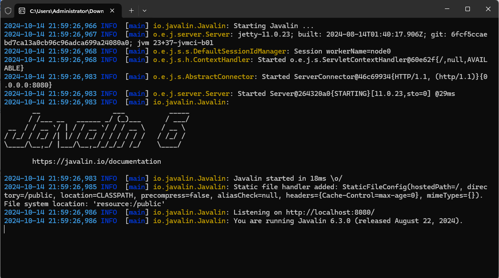

# Installation

## Download CodeToTrade App
Download the zip file from [CodeToTrade Download page](https://codetotrade.app/download/).

### Windows
1. Unzip andRun  `codetotrade-pro.exe` 

2. Go to localhost:8080 to use the app


### macOS
1. Unzip and Go to the folder
```
chmod +x codetotrade-pro
./codetotrade-pro
```
You may need to allow the app in the security settings of your mac.

2. Go to localhost:8080 to use the app

### Linux
1. Unzip and Go to the folder
```
chmod +x codetotrade-pro
./codetotrade-pro
```
2. Go to localhost:8080 to use the app

### Docker
1. Install Docker
2. Run the following command to start the app
```Bash
docker run -p 8080:8080 -v .:/home/codetotrade/.codetotrade -d codetotrade/codetotrade-pro

```
3. Go to localhost:8080 to use the app
#### Docker Note : 

##### User data volume

All generated data by user will be store in /home/codetotrade/.codetotrade folder in container . you can mount it to the host volume

##### Connect to client

Instead connect to client by localhost:[your_back_test_port] , you should replace it by host.docker.internal:[your_back_test_port]


