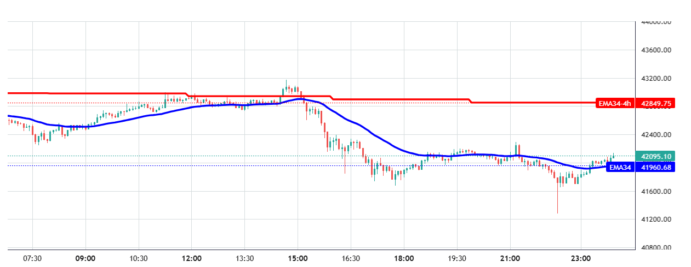
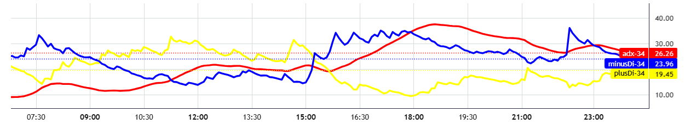

# Concept

## Bar 
Bar is a candle . That include start time, end time, open, high, low, close price and volume.
```json
{
    "open": 10000,
    "high": 10000,
    "low": 10000,
    "close": 10000,
    "volume": 10000,
    "startTime": "2024-01-01 00:00:00",
    "endTime": "2024-01-01 00:05:00",
}
```
## Bar series
Bar series is an object contain a list of bar and methods to access the bar by index .

## TradeMetaData
TradeMetaData is an object contain trade information. 
```json
{
    "price": 10000,
    "amount": 0.1,
    "takeProfitPrice": 12000,
    "takeStopLossPrice": 8000,
    "tradeLog": "5", # You can log any information to tracking the trade
    "waitingMinutes": 30, # waiting time before cancel order (Limit order only)
    "onlinePayload": {
        "order_id": "1234567890" # order id from exchange ( real trading only)
    }
}
```
## Chart
Chart is an object contain list of plot and it's metadata that help you visualize the indicators into the trade report. We support 2 chart types:

- Overlay: The chart will be display in the candle chart.
    
- Non-Overlay: The chart will be display in the separate panel.
    

```json
{
    "isOverlay": true,
    "name": "RSI",
    "backgroundColor": "#000000",
    "width": 100,
    "height": 100,
    "plotList": [
       ...
    ]
}
```
## Plot
Plot is an object contain the values of the indicator and it's metadata. We support 2 types of plot:

- Line: The plot will be display as a line chart.

- Column: The plot will be display as a column chart (histogram chart).

```json
{
    "name": "RSI",
    "color": "#000000",
    "style": "LINE",
    "pricePrecision": 2,
    "valueList": [1, 2, 3, 4, 5] # list of value of the indicator it should be the same length as the List of bar in BarSeries
}
```