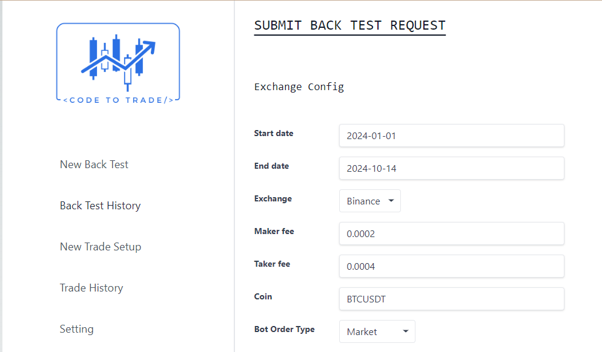
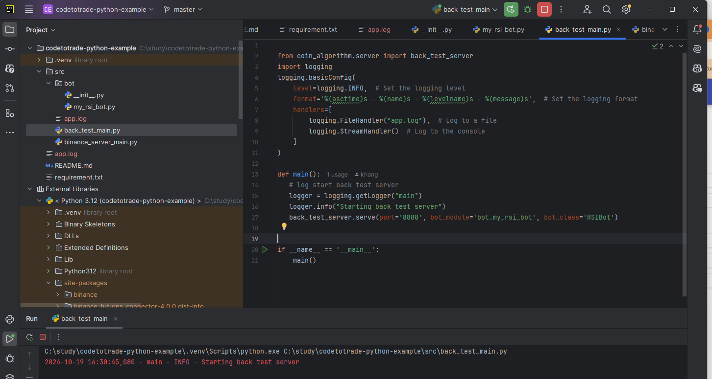
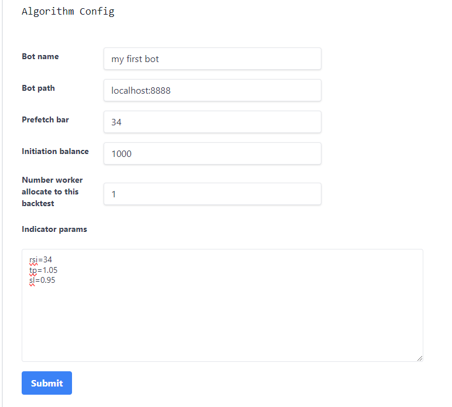

# Getting started

<iframe width="560" height="315" src="https://www.youtube.com/embed/mvMNFfPJteU?si=oh35sflCBp18V8Gt" title="YouTube video player" frameborder="0" allow="accelerometer; autoplay; clipboard-write; encrypted-media; gyroscope; picture-in-picture; web-share" referrerpolicy="strict-origin-when-cross-origin" allowfullscreen></iframe>

## Step 1 : Run the bot server 

After [Install](/installation) and run you should access the codetotrade application via localhost:8080

## Step 2 :  Run the bot client

### Checkout and Follow read me 
=== "Java"
        https://github.com/truongnhukhang/codetotrade-java-example.git
=== "Python"
        https://github.com/truongnhukhang/codetotrade-python-example.git

You can run from command line or Use IDE to start the main file (Inteliji or PyCharm Communitiy)

## Step 3 :  Run The Back Test

### Create a back test request
- Go to : http://localhost:8080/backtest/create
- Keep Exchange Config default 
- Inuput Algorithm Config same as below picture  

- Then submit

## Step 4 :  View result
- Go to : http://localhost:8080/backtest/collection

