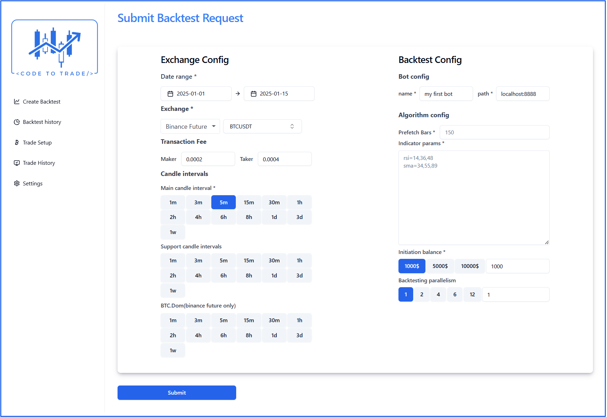

# Getting started

## Step 1 : Run the bot server 

After install and run you should access the codetotrade application via localhost:8080

## Step 2:  Run the bot client

### Checkout and Follow read me 
=== "Java"
        https://github.com/truongnhukhang/codetotrade-java-example.git
=== "Python"
        https://github.com/truongnhukhang/codetotrade-python-example.git

You can run from command line or Use IDE to start the main file (Inteliji or PyCharm Communitiy)

## Step 3 :  Run The Back Test

### Create a back test request
- Go to : http://localhost:8080/backtest/create
- Keep Exchange Config default 
- Inuput Algorithm Config same as below picture  

- Then click submit 
