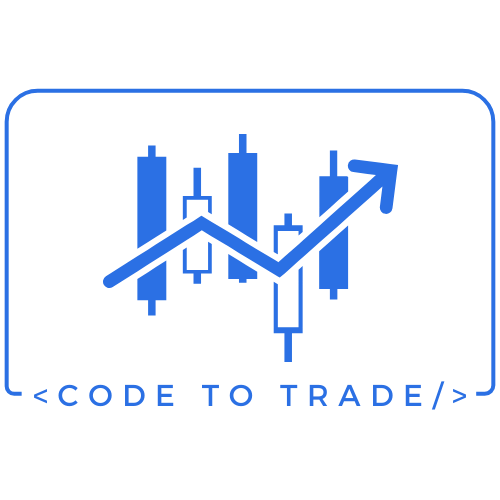
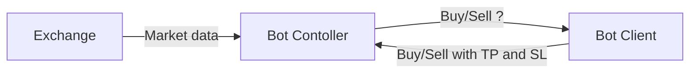

# Introduction
<div class="result" markdown>
{ align=left width="200" }
CodeToTrade is a comprehensive coin trading platform that supports backtesting, paper trading, and real trading on supported exchanges. It is developed in Java and compiled into native applications for various operating systems (Windows, Linux, macOS) using GraalVM.
</div>
The platform was created with the mission to empower anyone to easily build, test, and deploy their own trading bots. 

##  Overview


The **CodeToTrade** platform is structured into two main components: **BotController** and **BotClient**.

#### 1. **BotController**
The **BotController** (also known as the CodeToTrade application) is responsible for managing and processing market data. It receives information such as candles, ticks, and volume, normalizes it, and then interacts with the **BotClient** to request trading advice. The **BotController** queries the **BotClient** with the following types of decisions:

- **Should we buy at this candle?**
- **Should we sell at this candle?**
- **If we buy or sell, how much should we buy or sell?**
- **What should the Stop Loss and Take Profit prices be?**

The **BotController** serves as the primary interface that links market data with the decision-making capabilities of the **BotClient**.

#### 2. **BotClient**
The **BotClient** is a critical part of the architecture responsible for providing trading advice to the **BotController** based on the data it receives. It is your responsibility to design and implement the **BotClient** to respond effectively to the queries made by the **BotController**. 

The **BotClient** can be designed to leverage different strategies, ranging from simple technical analysis to more advanced AI-based approaches. Examples of decision-making logic include:

- **Technical Analysis**:  
  - **Should we buy at this candle?**  
    - If the Relative Strength Index (RSI) is below 30, the answer could be: **Yes, let's buy.**

- **Advanced AI or Data-Driven Methods**:  
  - **Should we sell at this candle?**  
    - For example: "Hey ChatGPT, here are the last 100 BTC candle prices. Should I sell now?"

Your primary task is to create a **BotClient** that can process the normalized market data from the **BotController** and provide actionable advice on trading decisions. The logic for this advice can be implemented using various methodologies, including but not limited to:

- **Technical Indicators** (e.g., RSI, MACD, moving averages)
- **Machine Learning Models** (e.g., price predictions based on historical data)
- **AI Models** for pattern recognition or anomaly detection in market trends.

Each decision made by the **BotClient** should be communicated back to the **BotController**, which will then handle the execution of trades based on the strategy you've implemented.

#### Example for Bot Client
```Python
class MyFirstBot(BaseBot):
    # Should we buy at this candle?
    def is_buy(self, idx: int) -> bool:
        pass
    # Should we sell at this candle?
    def is_sell(self, idx: int) -> bool:
        pass
    #  how much should we buy ? What should the Stop Loss and Take Profit prices be?
    def buy(self, idx: int) -> TradeMetadata:
        pass
    #  how much should we sell? What should the Stop Loss and Take Profit prices be?
    def sell(self, idx: int) -> TradeMetadata:
        pass
```

## Scope

We are committed to providing a robust trading platform. Based on the architecture overview, our responsibility is to maintain the **BotController** and all related components, which include:

- Creating and maintaining exchange connections and ensuring the accuracy of market data.
- Providing and maintaining the connection between **BotController** and **BotClient**.
- Offering contracts or interfaces between **BotController** and **BotClient**.

Please note that we do not create or maintain your **BotClient** source code. While we strive to provide the best support possible, it is ultimately your responsibility to maintain your **BotClient**.

## Disclamer

CodeToTrade.app does not provide any financial or trading advice. All trading decisions are made solely by your BotClient, and we do not guarantee the outcome of your trades. 

Additionally, no software is released without bugs, including ours. We cannot guarantee that the platform will function flawlessly over time. By using CodeToTrade.app, you acknowledge that any financial losses resulting from bugs, errors, or trading decisions are your responsibility, not ours. 

**Use this platform at your own risk, and we disclaim all liability for financial losses.**