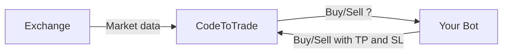

# Introduction

{ align=left width="200" }
CodeToTrade is a coin trading plaform . which is support back test , paper trading , real trade on support exchange . It is written by Java and complie to native application for supported OS (Windows , Linux , MacOS ) by GraalVM . 

The app was born with a mission to provide a platform where anyone can easily build their own trading bot.

## The Overview

The codeToTrade application is responsible for receiving market data, such as candle, tick, and volume information, and normalizing it before interacting with your bot. The app asks crucial trading questions based on this data, such as:

- Should we buy at this candle?
- Should we sell at this candle?
- If we buy or sell, how much should we buy or sell? What should the Stop Loss and Take Profit prices be?

Your primary task is to implement the logic that answers these questions using your trading algorithm. This could range from simple technical analysis techniques like:

- Should we buy at this candle? => If the RSI is below 30, yes, let's buy.

To more advanced or AI-driven approaches:

- Should we sell at this candle? => "Hey ChatGPT, here are the last 100 candles of btc close price. Should I sell now?"

Your job is to create the strategy that drives these decisions.

## Project layout

    mkdocs.yml    # The configuration file.
    docs/
        index.md  # The documentation homepage.
        ...       # Other markdown pages, images and other files.
