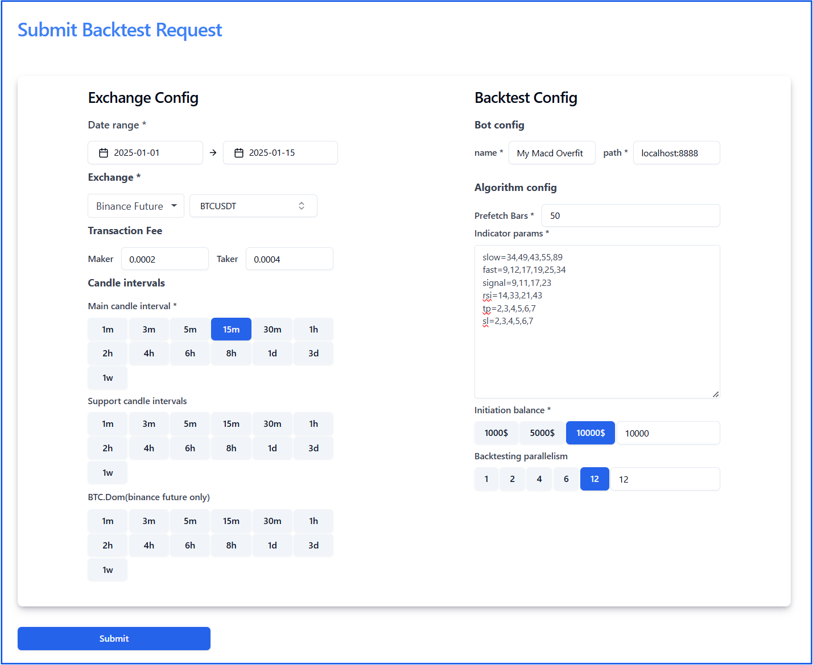

# Run the Deep (Overfit) Backtesting

## Overview

Deep backtesting, also known as overfit backtesting, is a technique used to evaluate and optimize trading algorithms by exploring a wide range of parameter combinations. This approach allows traders and developers to gain insights into how robust their strategies are under various conditions, helping them identify potential improvements or weaknesses.

### Why Use Deep Backtesting?

When designing a trading algorithm, fixed parameters may not fully capture the algorithm's potential or limitations. By systematically testing multiple combinations of parameters, deep backtesting helps:

   - Uncover the best-performing parameter sets.

   - Assess the robustness of the trading strategy across different market conditions.

   - Detect overfitting by evaluating consistency in performance.

   - Identify opportunities to refine the algorithm for better outcomes.

## Example Trading Algorithm

For demonstration, consider the following simple trading algorithm:

1. **Buy Signal**:
    - When the Moving Average Convergence Divergence (MACD) indicator satisfies `MACD(fast=12, slow=26) > MACD_Signal(signal=9)`, and
    - The Relative Strength Index (RSI) is below 70 (`RSI(14) < 70`).

2. **Sell Signal**:
    - When the MACD indicator satisfies `MACD(fast=12, slow=26) < MACD_Signal(signal=9)`, and
    - The RSI is above 30 (`RSI(14) > 30`).

3. **Risk Management**:
    - A stop-loss percentage of 2%.
    - A take-profit percentage of 3%.

## Parameterization for Deep Backtesting

In deep backtesting, the algorithm's parameters are varied systematically to create a comprehensive set of test cases. The parameters and their respective possible values for this algorithm are as follows:

- **MACD Fast Period (`fast`)**: `12, 17, 19, 9, 25, 34, 49, 43, 55`
- **MACD Slow Period (`slow`)**: `12, 17, 19, 9, 25, 34, 49, 43, 55`
- **RSI Period (`rsi`)**: `14, 33, 21, 43`
- **Stop-Loss Percentage (`sl`)**: `0.2, 0.3, 0.4, 0.5, 0.6`
- **Take-Profit Percentage (`tp`)**: `0.2, 0.3, 0.4, 0.5, 0.6`

## How It Works

The deep backtesting application generates all possible combinations of the given parameter values. For instance:

1. **Combination 1**: `fast=12, slow=12, rsi=14, sl=0.2, tp=0.2`
2. **Combination 2**: `fast=12, slow=12, rsi=14, sl=0.2, tp=0.3`
3. **Combination 3**: `fast=12, slow=12, rsi=14, sl=0.2, tp=0.4`
4. ...
5. **Combination N**: `fast=55, slow=55, rsi=43, sl=0.6, tp=0.6`

The application runs a backtest for each combination and records the results, including metrics such as profit and loss (PNL), win rate, drawdowns, and more.

### Input and Output

1. **Input**:  
   Users provide the parameter lists through an input field, e.g., `indicator_params`. The application automatically generates and tests all combinations.
   
2. **Output**:
    - Results for each parameter combination.
    - Summary metrics reflecting the algorithm's overall performance.

### Interpretation of Results

If most backtests yield positive PNL, the algorithm can be considered robust. However, if the performance is inconsistent or mostly negative, the algorithm may require modifications or further analysis.

## Benefits of Deep Backtesting

- **Comprehensive Analysis**: Evaluates the algorithm under a variety of conditions.
- **Optimization**: Identifies parameter combinations that maximize performance.
- **Risk Mitigation**: Helps detect overfitting and ensure real-world applicability.
- **Data-Driven Decisions**: Empowers traders to refine strategies based on evidence.

## Conclusion

Deep backtesting is a powerful tool for traders looking to maximize the potential of their trading algorithms. By systematically exploring various parameter combinations, it ensures a robust and well-optimized strategy, ready to tackle the dynamic nature of financial markets.
