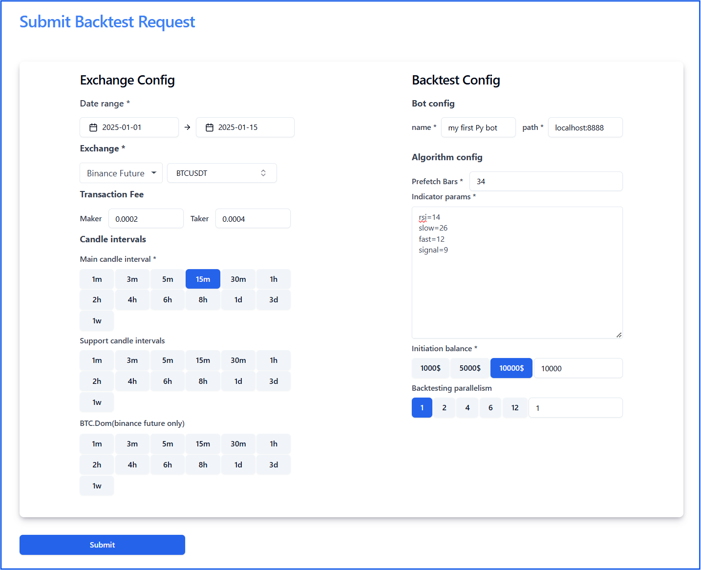

# Write the first trading bot
In this guide, i will show you how to easily to create your own trading bot.

## Step 1 : Find the trading idea

Here’s a simple algorithmic trading strategy for BTC/USDT using a Moving Average Convergence Divergence (MACD) strategy with a Relative Strength Index (RSI) filter. The idea is to use the MACD indicator to identify buy/sell signals and use the RSI as a confirmation filter to reduce false signals.


```
# Buy if MACD crosses above the signal line and RSI is below 70
if macd_line > signal_line and previous_macd_line <= previous_signal_line:
    if rsi < 70:
        return True
return False
```

```
# Sell if MACD crosses below the signal line and RSI is above 30
if macd_line < signal_line and previous_macd_line >= previous_signal_line:
    if rsi > 30:
        return True
return False
```

## Step 2 : Implement the trading idea

### Step 2.1 : Create a new bot

Firstly, You need to chose your language to start with. Then create a class extend the BaseBot class . 
=== "Java"
    ```Java
    public class MyMacdBot extends BaseBot {
    }
    ```

=== "Python"
    ```Python
    class MyMacdBot(BaseBot):
    ```

### Step 2.2 : Setup indicator in your bot
In this step, we'll set up the MACD and RSI indicators in the init method of your bot. This method is called when the bot is initialized, allowing you to configure your indicators with parameters from the backtest UI.

=== "Java"
    ```Java
    @Override
    public void init(Map<String, String> config) {
        BarSeries series = getBarSeries(); 
        ClosePriceIndicator closePrice = new ClosePriceIndicator(series);

        int rsiPeriod = Integer.parseInt(config.get("rsi"));
        this.rsi = new RSIIndicator(closePrice, rsiPeriod);

        int slow = Integer.parseInt(config.get("slow"));
        int fast = Integer.parseInt(config.get("fast"));
        int signalPeriod = Integer.parseInt(config.get("signal"));

        this.macd = new MACDIndicator(closePrice, fast, slow);
        this.signal = new EMAIndicator(macd, signalPeriod);
    }
        
    ```

=== "Python"
    ```Python
    def init(self, config: Dict[str, str]) -> None:
        rsi_period = int(config['rsi'])
        nd_closes = numpy.array(self.bar_series.closes, dtype=np.double)
        self.rsi = abstract.RSI(nd_closes, rsi_period)

        slow = int(config['slow'])
        fast = int(config['fast'])
        signal = int(config['signal'])
        self.macd, self.macdsignal, self.macdhist = abstract.MACD(nd_closes, fastperiod=fast, slowperiod=slow, signalperiod=signal)
    ```

### Step 2.3 : Implement the isBuy and isSell logic 
In this step we will implement the main trading logic of the bot. Which explain on step 1 .

=== "Java"
    ```Java
    @Override
    public boolean isBuy(int idx) {
        Num macdValue = macd.getValue(idx);
        Num signalValue = signal.getValue(idx);
        Num prevMacdValue = macd.getValue(idx - 1);
        Num prevSignalValue = signal.getValue(idx - 1);

        if (macdValue.isGreaterThan(signalValue) && prevMacdValue.isLessThanOrEqual(prevSignalValue)) {
            if (rsi.getValue(idx).doubleValue() < 70) {
                return true;
            }
        }
        return false;
    }

    @Override
    public boolean isSell(int idx) {
        Num macdValue = macd.getValue(idx);
        Num signalValue = signal.getValue(idx);
        Num prevMacdValue = macd.getValue(idx - 1);
        Num prevSignalValue = signal.getValue(idx - 1);

        if (macdValue.isLessThan(signalValue) && prevMacdValue.isGreaterThanOrEqual(prevSignalValue)) {
            if (rsi.getValue(idx).doubleValue() > 30) {
                return true;
            }
        }
        return false;
    }
    ```

=== "Python"
    ```Python
    def is_buy(self, idx: int) -> bool:
        if self.macd[idx] > self.macdsignal[idx] and self.macd[idx-1] <= self.macdsignal[-1]:
            if self.rsi[idx] < 70:
                return True
        return False

    def is_sell(self, idx: int) -> bool:
        if self.macd[idx] < self.macdsignal[idx] and self.macd[idx - 1] >= self.macdsignal[-1]:
            if self.rsi[idx] > 30:
                return True
        return False
    ```  


### Step 2.4 : Implement the buy and sell logic   

In this step we will give the answer of how much we want to buy and sell, provide trading logs via TradeMetadata object .

Example : We will buy 0.1 BTC at the market price ( close price in backTesting ), with a 3% profit and a 2% loss for each trade

=== "Java"
    ```Java
    @Override
    public TradeMetadata buy(int idx) {
        Bar currentBar = getBarSeries().getBar(idx);
        double btcAmount = 0.1;
        double entryPrice = currentBar.getClosePrice().doubleValue();
        double takeProfit = currentBar.getClosePrice().doubleValue() * 1.03;
        double stopLoss = currentBar.getClosePrice().doubleValue() * 0.98;
        String tradeLog = String.format("MyMacdBot Buy, MACD-SIGNAL:%f-%f,PREV(MACD-SIGNAL):%f-%f, RSI: %f",
                macd.getValue(idx).doubleValue(),signal.getValue(idx).doubleValue(), macd.getValue(idx - 1).doubleValue(),
                signal.getValue(idx - 1).doubleValue(), rsi.getValue(idx).doubleValue());
        return new TradeMetadata(entryPrice, btcAmount, takeProfit, stopLoss, tradeLog, 30);
    }

    @Override
    public TradeMetadata sell(int idx) {
        Bar currentBar = getBarSeries().getBar(idx);
        double btcAmount = 0.1;
        double entryPrice = currentBar.getClosePrice().doubleValue();
        double takeProfit = currentBar.getClosePrice().doubleValue() * 0.97;
        double stopLoss = currentBar.getClosePrice().doubleValue() * 1.02;
        String tradeLog = String.format("MyMacdBot Sell, MACD-SIGNAL:%f-%f,PREV(MACD-SIGNAL):%f-%f, RSI: %f",
                macd.getValue(idx).doubleValue(),signal.getValue(idx).doubleValue(), macd.getValue(idx - 1).doubleValue(),
                signal.getValue(idx - 1).doubleValue(), rsi.getValue(idx).doubleValue());
        return new TradeMetadata(entryPrice, btcAmount, takeProfit, stopLoss, tradeLog, 30);
    }
    ```
=== "Python"
    ```Python
    def buy(self, idx: int) -> TradeMetadata:
        current_bar = self.bar_series.bars[idx]
        btc_amount = 0.1
        entry_price = current_bar.close
        take_profit_price = current_bar.close * 1.03
        stop_loss_price = current_bar.close * 0.98
        trade_log = "MyMacdBot Buy, MACD-SIGNAL:{:.6f}-{:.6f},PREV(MACD-SIGNAL):{:.6f}-{:.6f}, RSI: {:.6f}"
                          .format(self.macd[idx], self.macdsignal[idx], self.macd[idx], self.macdsignal[idx], self.rsi[idx])
        return TradeMetadata(entry_price, btc_amount, take_profit_price, stop_loss_price, trade_log=trade_log)

    def sell(self, idx: int) -> TradeMetadata:
        current_bar = self.bar_series.bars[idx]
        btc_amount = 0.1
        entry_price = current_bar.close
        take_profit_price = current_bar.close * 0.97
        stop_loss_price = current_bar.close * 1.02
        trade_log = "MyMacdBot Sell, MACD-SIGNAL:{:.6f}-{:.6f},PREV(MACD-SIGNAL):{:.6f}-{:.6f}, RSI: {:.6f}"
                          .format(self.macd[idx],self.macdsignal[idx],self.macd[idx],self.macdsignal[idx],self.rsi[idx])
        return TradeMetadata(entry_price,btc_amount,take_profit_price,stop_loss_price,trade_log=trade_log)
    ```

## Step 3 : Back Test your first bot

Firstly we create a Main class to run our bot.
=== "Java"
    ```Java
    public class BackTestMain {
        private static final Logger log = LoggerFactory.getLogger(BackTestMain.class);

        public static void main(String[] args) throws IOException, InterruptedException {
            log.info("Starting BackTest {}", MyMacdBot.class);
            BackTestServer server = new BackTestServer(8888, MyMacdBot.class);
            server.start();
            server.blockUntilShutdown();
        }
    }
    ```

=== "Python"
    ```Python
    from coin_algorithm.server import back_test_server
    import logging
    logging.basicConfig(
        level=logging.INFO,  # Set the logging level
        format='%(asctime)s - %(name)s - %(levelname)s - %(message)s',  # Set the logging format
        handlers=[
            logging.FileHandler("app.log"),  # Log to a file
            logging.StreamHandler()  # Log to the console
        ]
    )

    def main():
        # log start back test server
        logger = logging.getLogger("main")
        logger.info("Starting back test server")
        back_test_server.serve(port='8888', bot_module='bot.my_macd_bot', bot_class='MyMacdBot')

    if __name__ == '__main__':
        main()
    ```
Then create a back test with the following configuration


## Step 4 : Evaluate back test result

Go to back test history page . Find the latest one . You can see the back test result


## Step 5 : Run the bot in real exchange

Whenever you believe your bot is ready, you can run it in real exchange and make some profits.

Fristly . You need swap back_test_server to the exchange server and run the bot.
=== "Java"
    ```Java
    public class BackTestMain {
        private static final Logger log = LoggerFactory.getLogger(BackTestMain.class);

        public static void main(String[] args) throws IOException, InterruptedException {
            log.info("Starting Binance Exchange Server {}", MyMacdBot.class);
            BinanceServer server = new BinanceServer("", "", false, 8888, MyMacdBot.class);
            server.start();
            server.blockUntilShutdown();
        }
    }
    ```

=== "Python"
    ```Python
    from coin_algorithm.server import back_test_server
    import logging
    logging.basicConfig(
        level=logging.INFO,  # Set the logging level
        format='%(asctime)s - %(name)s - %(levelname)s - %(message)s',  # Set the logging format
        handlers=[
            logging.FileHandler("app.log"),  # Log to a file
            logging.StreamHandler()  # Log to the console
        ]
    )

    def main():
        # log start back test server
        logger = logging.getLogger("main")
        logger.info("Starting back test server")
        binance_server.serve(port='8888', bot_module='bot.my_macd_bot', bot_class='MyMacdBot', api_key='', secret_key='',is_test_net=Fal;se)

    if __name__ == '__main__':
        main()
    ```

Then go to the exchange page in the UI and run the bot `http://localhost:8080/online/create` . 

Exchange Config same as below picture ( nothing much different with back test config except we dont have date range )


The Algorithm Config is the same when we run the back testing


