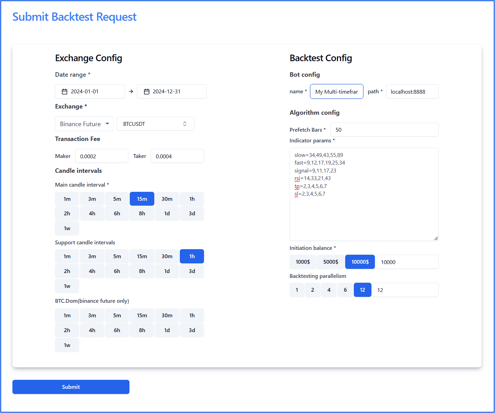

# Use multiple timeframe in your trading algorithm

## Overview

The ability to implement trading algorithms using multiple candle intervals is a powerful feature in algorithmic trading. This functionality allows traders to combine data from different timeframes, providing a more comprehensive analysis of market trends and conditions. 

By leveraging this feature, traders can create sophisticated strategies that are more adaptive to market dynamics, improving decision-making and potential profitability.

## Why Multi-Timeframe Analysis Matters

Markets exhibit behaviors that vary across timeframes. A trend visible in a 1-hour interval might not align with conditions seen in a 15-minute or 5-minute timeframe. Using multiple candle intervals enables traders to:

  - **Capture broader market trends** using higher timeframes.
  - **Refine entry and exit points** with detailed analysis from lower timeframes.
  - **Avoid false signals** by confirming conditions across multiple intervals.
  - **Improve strategy robustness** by considering multi-dimensional data.

## Example Strategy

Consider a trading strategy where:

- **Buy Signal**:
    - When the **MACD** on the 1-hour timeframe satisfies `MACD > MACD_Signal`
    - The **RSI** on the 5-minute timeframe indicates **not** overbought conditions (`RSI < 70`).

- **Sell Signal**:
    - When the **MACD** on the 1-hour timeframe satisfies `MACD < MACD_Signal`
    - The **RSI** on the 5-minute timeframe indicates **not** oversold conditions (`RSI > 30`).

This approach combines a broader market perspective (1-hour MACD) with refined details from shorter timeframes (5-minute RSI) to enhance precision and reduce noise in decision-making.

## How It Works

### Setup your backtest configuration

**Exchange** : Binance Future

**Coin** : BTCUSDT

**Main candle interval** : 5m

**Support candle intervals** : 1h

**Date from**: 2024-01-01

**Date to**: 2024-11-21 .

**indicator params** : 

```
slow=34,49,43,55,89
fast=9,12,17,19,25,34
signal=9,11,17,23
rsi=14,33,21,43
tp=2,3,4,5,6,7
sl=2,3,4,5,6,7
```


### Bot Implementation Details

The most important part of this guide is understanding how to use the other timeframe BarSeries to support your trading algorithm.

#### init(Map<String, String> config | config: Dict[str, str])

=== "Java"
    ```java hl_lines="3 4 5"
    @Override
    public void init(Map<String, String> config) {
      // This is the way we access the BarSeries on the 1-hour timeframe  
      this.barSeries1h = otherBarSeries.get(Duration.ofMinutes(60));
      ClosePriceIndicator closePrice1h = new ClosePriceIndicator(barSeries1h);
      int slow = Integer.parseInt(config.get("slow"));
      int fast = Integer.parseInt(config.get("fast"));
      int signalPeriod = Integer.parseInt(config.get("signal"));
      // This is the MacdIndicator on the 1-hour timeframe
      this.macd = new MACDIndicator(closePrice1h, fast, slow);
      this.signal = new EMAIndicator(macd, signalPeriod);
      ...
    }
    ```
=== "Python"
    ```python hl_lines="2 3 4"
    def init(self, config: Dict[str, str]) -> None:
       // This is the way we access the BarSeries on the 1-hour timeframe  
       self.bar_series_1h = self.other_bar_series[60]
       nd_closes_1h = numpy.array(self.bar_series_1h.closes, dtype=np.double)
       slow = int(config['slow'])
       fast = int(config['fast'])
       signal = int(config['signal'])
       // This is the MacdIndicator on the 1-hour timeframe
       self.macd, self.macdsignal, self.macdhist = abstract.MACD(nd_closes_1h, fastperiod=fast, slowperiod=slow,
                                                                    signalperiod=signal)   
       ....
    ```
#### Buy(idx: int) and Sell(idx: int):

The bot loops through the main BarSeries and executes the trading logic at the current index of the bar. The key is converting the main BarSeries index to the 1-hour BarSeries index.

=== "Java"
    ```java hl_lines="3 4 5"
    @Override
    public boolean isBuy(int i) {
        // The BaseBot provide a utility function that help you find Index of The BarSeries by StartTime
        long startTime = barSeries.getBar(idx).getBeginTime().toInstant().toEpochMilli();
        int idx1h = getIndexOfBarSeriesByTime(barSeries1h, startTime);
        Num macdValue = macd.getValue(idx1h);
        Num signalValue = signal.getValue(idx1h);
        Num prevMacdValue = macd.getValue(idx1h - 1);
        Num prevSignalValue = signal.getValue(idx1h - 1);
        if (macdValue.isGreaterThan(signalValue) && prevMacdValue.isLessThanOrEqual(prevSignalValue)) {
            if (rsi.getValue(idx).doubleValue() < 70) {
                return true;
            }
        }
        return false;
    }
    ```
=== "Python"
    ```python hl_lines="2 3 4"
    def is_buy(self, idx: int) -> bool: 
        // The BaseBot provide a utility function that help you find Index of The BarSeries by StartTime
        start_time = self.bar_series.bars[idx].start_time
        idx_1h = self.get_index_of_bar_series_by_start_time(self.bar_series_1h, start_time)
        if self.macd[idx_1h] > self.macdsignal[idx_1h] and self.macd[idx_1h - 1] <= self.macdsignal[idx_1h-1]:
            if self.rsi[idx] < 70:
                return True
        return False
    ```

### Interpretation of Results

Using the same MACD and RSI trading algorithm, slight changes in timeframes can lead to significantly different trading results. You can run tests and observe how performance varies across configurations.


## Conclusion

The multi-timeframe support feature empowers traders to build strategies that are both dynamic and reliable. By integrating data from different intervals, it opens the door to more sophisticated analyses and better trading outcomes, making it an essential tool for algorithmic trading. 

## Appendix
### Source code
=== "Java"
    [MacdMultiTimeFrameTestBot](https://github.com/truongnhukhang/codetotrade-java-example/blob/master/src/main/java/coin/algorithm/example/bot/MyMacdMultiTimeFrameTestBot.java)
=== "Python"
    [MacdMultiTimeFrameTestBot](https://github.com/truongnhukhang/codetotrade-python-example/blob/master/src/bot/my_multi_timeframe_macd_bot.py)